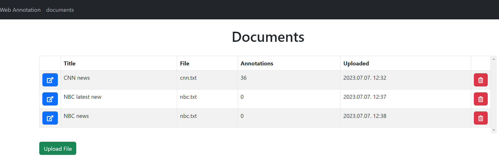

# WebAnnotationApp
This project was created for the Project Laboratory course at Budapest University of Technology.

This is a web application where users can create annotations on uploaded english text documents.

There are two types of annotations:
- __Entity annotation__: identifies a text snippet with a named tag

- __Relational annotation__: identifies a directed relation between two entity annotation with a named tag

The application also supports machine-assisted annotation.

## Views

### Annotations

### Document list

### Upload documents

